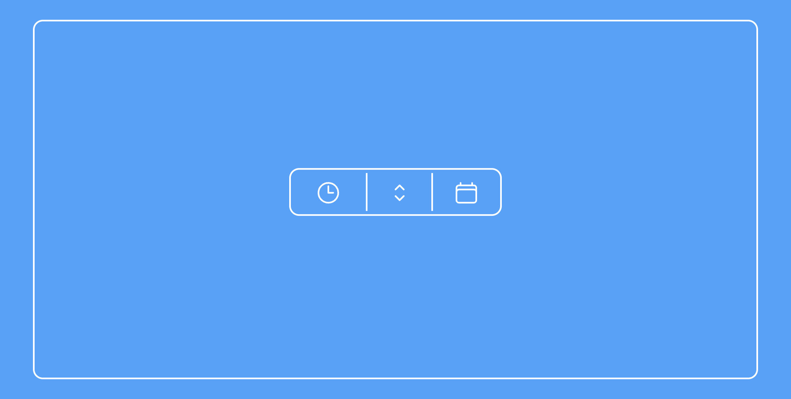

# The Counters
## Descrizione
_The counters_ raccoglie i 3 contatori per eccellenza:
  - **_Stopwatch_**: permette di avviare un timer per contare secondi, minuti ed ore.
  - **_Counter_**: permette di incrementare o dominuire di una unità partendo da 0.
  - **_Calendar_**: permette di selezionare una data futura e determinare il tempo mancante al raggiunggimento del giorno selezionato.

In tutti e 3 i contatori i dati vengono salvati nel 'localStorage', questo per evitare di perdere il conto. **Altrimenti che contatori sarebbero?!**

---
## Realizzazione
Il proggetto è stato realizzato a compimento del percorso di JavaScript basisc di **start2impact**.
### Le richieste tecniche:
_L'applicazione deve essere sviluppata con JavaScript._
_Non è permesso l'utilizzo di Jquery, non è permesso l'utilizzo di nessun framework (React, Angular, Vue o altri)._
_È permesso l'utilizzo, se necessario, di librerie esterne JavaScript._
_I pulsanti +/- e la visualizzazione del valore del counter devono essere costruiti con la manipolazione del DOM con JavaScript._
_Una volta costruiti gli elementi con JavaScript, si dovrà implementare la funzione che aggiungerà e diminuirà il valore del counter._
_Sono ammesse tutte le funzionalità aggiuntive che si ritengono necessarie._

## Linguaggi utilizzati:
  * HTML
  * CSS _(Tailwind)_
  * JavaScript
## Contatti:
<a href='https://github.com/Pgalli992/MyPortfolio_html_css_s2i_project.git'>Link al Portfolio: Paolo Galli<a>

## BONUS 🐣
Trova l'EasterEgg prima di dare un'occhiata al codice.
